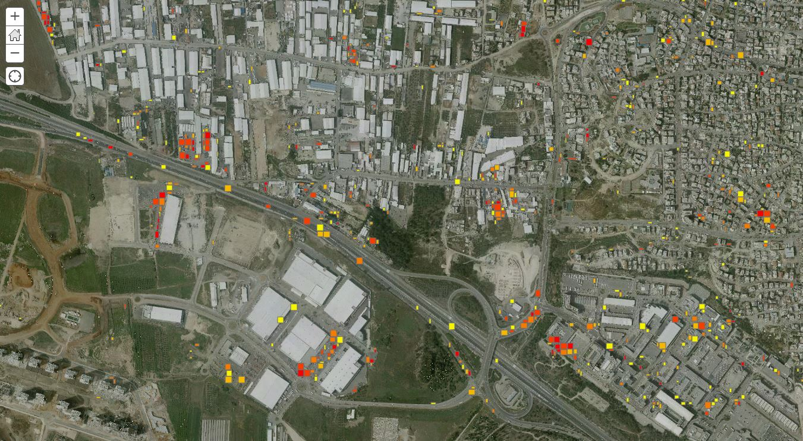
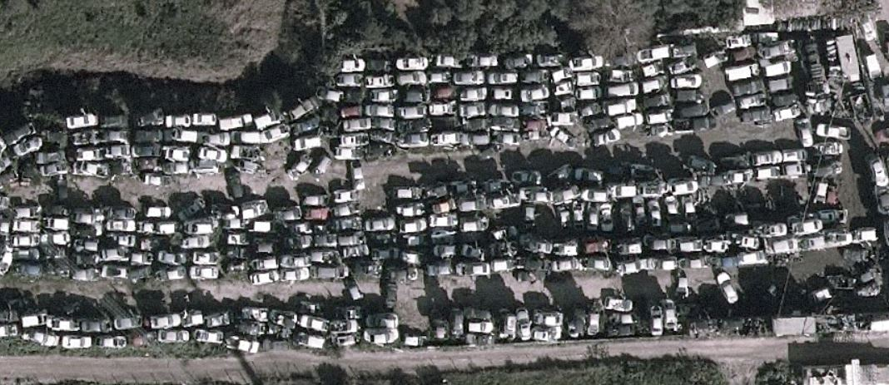
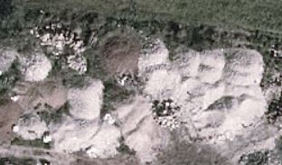
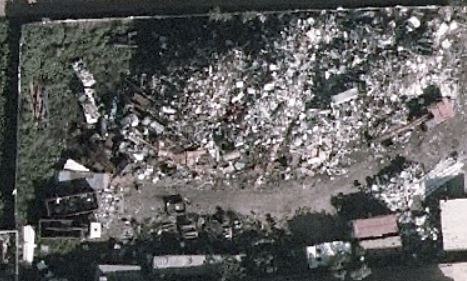
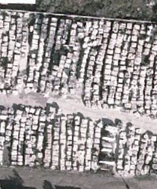
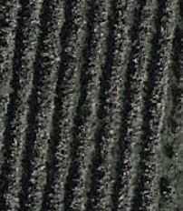
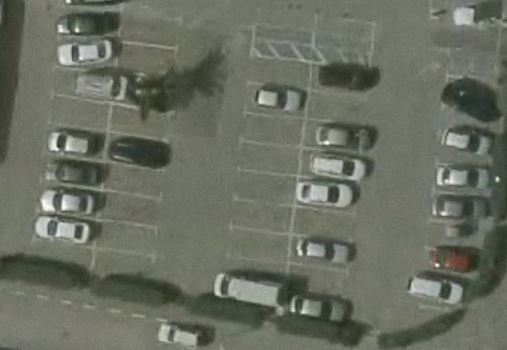
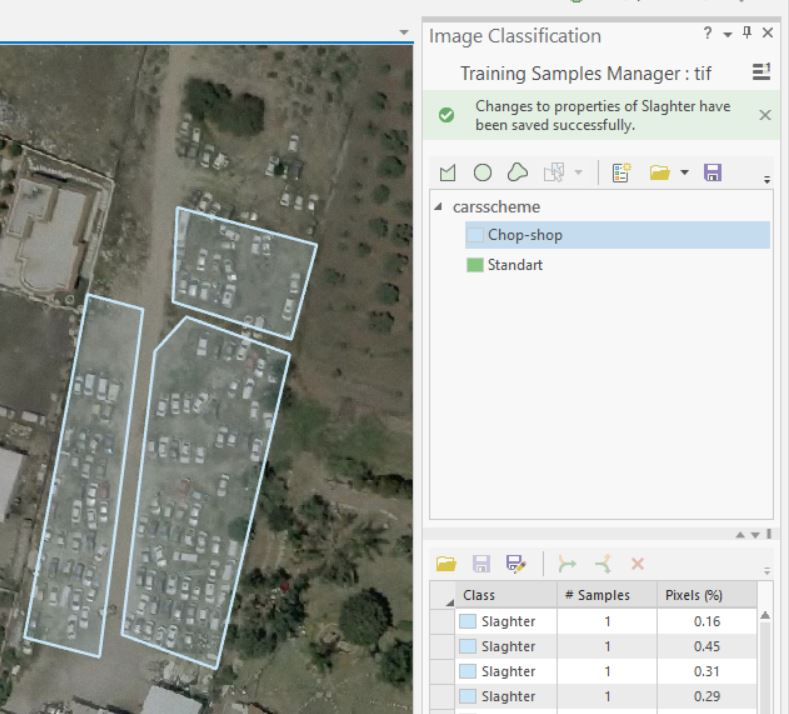

## detecting chop shops in aerial imagery using SSD Network Architecture

# Contents

[***Objective***](https://github.com/uriaLevko/ChopShopSitesDetection-SSD-#objective)

[***Concepts***](https://github.com/uriaLevko/ChopShopSitesDetection-SSD-#concepts)

[***Overview***](https://github.com/uriaLevko/ChopShopSitesDetection-SSD-#overview)

<!-- [***Implementation***](https://github.com/sgrvinod/a-PyTorch-Tutorial-to-Image-Captioning#implementation) 

<!-- [***Training***](https://github.com/sgrvinod/a-PyTorch-Tutorial-to-Image-Captioning ## Training SSD - no true negative samples)

<!-- [***Inference***](https://github.com/sgrvinod/a-PyTorch-Tutorial-to-Image-Captioning#inference) -->

# Objective
Detecting chop-shops sites(also known as car slaghter sites) from aeriel imagery, Using single shot detector

# concepts

* **SSD**: a method for detecting objects in images using a single deep neural network, by discretizes the output space of bounding boxes into a set of default boxes over different aspect ratios and scales per feature map location. At prediction time, the network generates scores for the presence of each object category in each default box and produces adjustments to the box to better match the object shape. 

* **Transfer Learning**: This is when you borrow from an existing model by using parts of it in a new model. This is almost always better than training a new model from scratch (i.e., knowing nothing). As you will see, you can always fine-tune this second-hand knowledge to the specific task at hand. Using pretrained word embeddings is a dumb but valid example. For our image captioning problem, we will use a pretrained Encoder, and then fine-tune it as needed.

# Overview

In this project iv'e Trained a Single-Shot-Detector and feature detection model to detect chop shops in aerial imagery.
The whole process was made using arcgis.learn library, developed by esri, and is based on fast.ai. 

**question 1:** How does a Chop-shop looks like?

At first glance, it looks like different chop-shops might have different background, structure and spread.

**Question 2:** What similar areas might be found in the aerial imagery (or, what kind of false positive should we expect)?
<table><tr>
<td>  </td>
    <td></td><td></td>
<td>  </td>
    <td></td><td></td>
</tr></table>

<table> <tr>
<td> 
</td>
    <td></td><td></td>
<td>  </td>
    <td></td><td></td>
</tr></table>

<table><tr>
<td>  </td>
    <td></td><td></td>
<td>  </td>
    <td></td><td></td>
</tr></table>

## Training SSD - no true negative samples

We began by creating samples of chop shops, using the Training Samples Manager in ArcGIS Pro. We had a relatively small area to track samples at, and we were only able to detect around 120 samples of chop-shops.
we also added a second class of parking places. Due to their similarity, and a relativatly small amount of samples, it was naive to expect the model would be able to provide good results.
After examination of the results, there were too many false positives.we decided to provide true negatives samples.
we decided to provide true negatives samples, and train the model again, using the new samples as background.

Project Instructions
The project is be broken up into two Python notebooks; the first two are for the SSD implementation and the other is for the feature classifire:

[__Notebook 1__](./SSD_FINAL.ipynb) : SSD

[__Notebook 2__](./FC_FINAL.ipynb) : feature classifier

You can also view the helper files writen as part of this project in the moduls library.

LICENSE: This project is licensed under the terms of the esri license product. There is no approval to copy or use this code without permission
